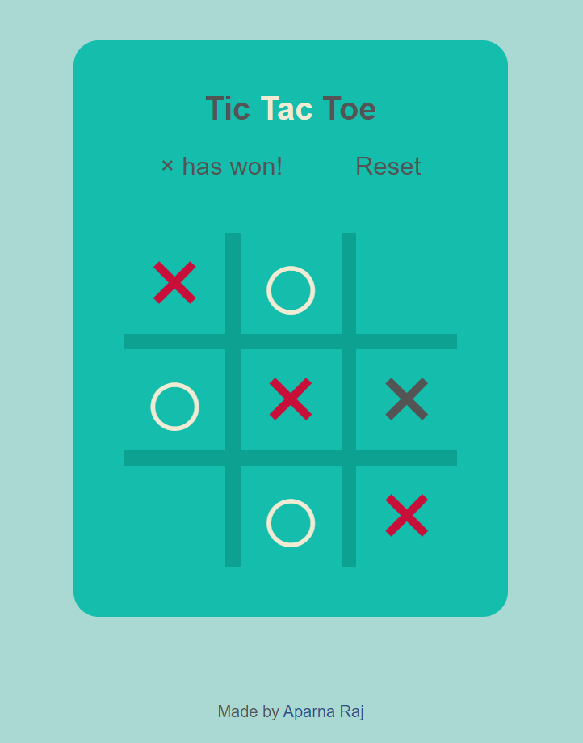

# Tic-Tac-Toe
The Tic Tac Toe game is a game for two players, who take turns marking the spaces in a 3×3 grid. The player who succeeded in placing three respective marks in a row, column, or a diagonal wins the game.

# Deployment
Deployed Website: https://aparnaraj23.github.io/Tic-Tac-Toe/

